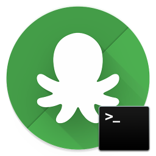

# octoprint-cli

[](https://github.com/UserBlackBox/octoprint-cli/releases/latest) [](https://creativecommons.org/licenses/by-nc-sa/4.0)



Python 3 command line tool for controlling OctoPrint servers

This tool uses the OctoPrint API to control and view the status of 3D printers connected to OctoPrint servers

This project is a work in progress. Some features may not work as intended or be missing. If you have suggestions or find bugs, please report them in [issues](https://github.com/UserBlackBox/octoprint-cli/issues).

## Features
These are the features that have been implemented so far, more functions will be implemented in the future. Current progress on features can be found on the [project board](https://github.com/UserBlackBox/octoprint-cli/projects/1).

* Printer connection status
* Print job status
* File selection
* Pause, resume, cancel prints
* Start print
* System commands (shutdown, reboot, restart)
* Listing files/folders
* Retrieving file/folder information
* Setting extruder and bed temperature
* Connect and disconnect from printer
* Continuous status output with temperature status and progress bar
* GCODE file uploads to server storage
* Layer information from OctoPrint-DisplayLayerProgress plugin if installed on server

## Limitations

Currently, octoprint-cli is limited to only printers with a single extruder and bed. Support for additional extruders and chambers may be implemented in the future. This program has been tested on OctoPi 0.17.0 on the Raspberry Pi 4 running OctoPrint 1.4.0 with a Monoprice Select Mini V2.

Colored and formatted text is not available on Windows systems due to the lack of support on cmd and powershell terminals

The program requires the API key to have all permissions to run

## Dependencies

Can be found in `requirements.txt`
* termcolor
* requests

## Configuration

The tool reads its configuration from either `config.ini` in the current directory or from `~/.config/octoprint-cli.ini` on Linux systems

A sample config file has been included in `sample-config.ini`

```ini
[server]
;Set OctoPrint server address and x-api-key
ServerAddress = SERVER_ADDRESS_HERE
ApiKey = API_KEY_HERE

[preferences]
;Set if the program uses colored or formatted text, this setting is turned off on windows due to cmd and powershell limitations
FormattedText = true

[printer]
;Set maximum temperature that printer can be set to
MaxExtruderTemp = 250
MaxBedTemp = 85
```

## Usage

```
octoprint-cli
===============================================================================
command line tool to control octoprint servers

COMMANDS
octoprint-cli help                      view this help message
octoprint-cli print status              view job status
octoprint-cli print select [file]       load file
octoprint-cli print start               start print
octoprint-cli print pause               pause print
octoprint-cli print resume              resume print
octoprint-cli print cancel              cancel print
octoprint-cli connection status         view connection status
octoprint-cli connection connect        connect to printer with autodetection
octoprint-cli connection disconnect     disconnect from printer
octoprint-cli temp status               view printer temperature status
octoprint-cli temp extruder [target]    set extruder target temperature
octoprint-cli temp bed [target]         set bed target temperature
octoprint-cli files list                list files and folders in root dir
octoprint-cli files list [dir]          list files in directory
octoprint-cli files info [name]         get information on file or folder
octoprint-cli files upload [file]       upload file to OctoPrint server storage
octoprint-cli system restart            restart OctoPrint server
octoprint-cli system restart-safe       restart OctoPrint server to safe mode
octoprint-cli system reboot             reboot server
octoprint-cli system shutdown           shutdown server
octoprint-cli continuous                get refreshing continuous status
octoprint-cli layers                    view DisplayLayerProgress information
```

## Completions
A zsh completion file can be found in `_octoprint-cli`

## License
<p xmlns:dct="http://purl.org/dc/terms/" xmlns:cc="http://creativecommons.org/ns#" class="license-text"><a rel="cc:attributionURL" property="dct:title" href="https://github.com/UserBlackBox/octoprint-cli">octoprint-cli</a> by <a rel="cc:attributionURL dct:creator" property="cc:attributionName" href="https://github.com/UserBlackBox">Quentin Fan-Chiang</a> is licensed under <a rel="license" href="https://creativecommons.org/licenses/by-nc-sa/4.0">CC BY-NC-SA 4.0

</a></p>

